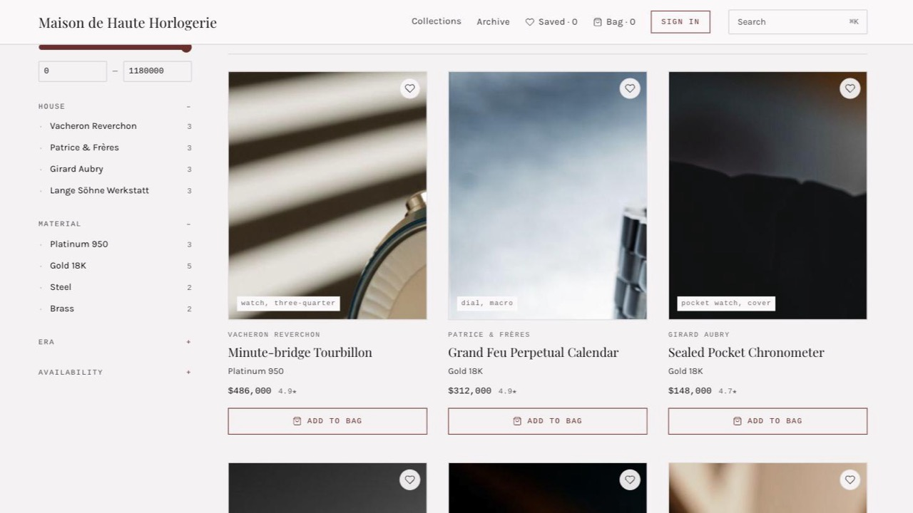

# Maison — a printed archive, not a webshop

**Free classic Astro e-commerce theme.** Serif typography on warm paper, hairline rules,
three archive houses and a patron cabinet — no neon, no glow, no checkout theatre.

**[Live demo →](https://astro-njx-maison.pages.dev)** ·
[More themes at njxui.dev](https://njxui.dev/themes)



## What's inside

- **Printed editorial design** — Playfair Display headlines, Karla text, Cousine
  small-caps labels, one bordeaux accent, hairline rules everywhere.
- **Three archive houses** in one theme — a Geneva watchmaking maison (est. 1888),
  a Savile Row bespoke atelier (est. 1904) and a Paris antiquarian cabinet
  (est. 1792) — each with its own manifesto, mega menu, search suggestions and
  36-piece catalogue.
- **Faceted archive rail** — valuation range, house, material, era, availability;
  live counts and printed chips.
- **One-of-one commerce** — every piece is unique: a private vault, an acquisition
  bag with a total valuation and a "Request the keeper" flow instead of a checkout.
- **Patron cabinet** — stats strip, orders with a four-step craft progress
  (Preparation → Hand-crafting → Inspection → Dispatched), activity log,
  residences, privileges.
- **Live currency switch** — USD / EUR / GBP; every price on the site reprices
  instantly.
- **Full-screen serif search** on `⌘K` and `/` across all three houses.
- **SEO-ready** — static piece records with Product + AggregateRating JSON-LD,
  Open Graph, sitemap-friendly.

## Quick start

```bash
git clone https://github.com/njbSaab/astro-njx-maison.git
cd astro-njx-maison
npm install
npm run dev
```

The theme runs out of the box on the bundled mock catalogue — no keys, no accounts.

## Connect Shopify (optional)

The commerce layer is provider-based. Two env vars switch it from mock data to
the Shopify Storefront API:

```bash
COMMERCE_PROVIDER=shopify
SHOPIFY_STORE_DOMAIN=your-store.myshopify.com
SHOPIFY_STOREFRONT_TOKEN=your-storefront-access-token
```

Rebuild, and the archive renders your live products.

## Stack

[Astro 5](https://astro.build) · [Tailwind CSS v4](https://tailwindcss.com) ·
[nanostores](https://github.com/nanostores/nanostores) — static output, deploys
anywhere (Cloudflare Pages, Netlify, Vercel, GitHub Pages).

## Rebrand in two files

1. `scripts/gen-catalog.py` — houses, categories and the 36-piece catalogue.
2. `src/styles/global.css` — the paper, ink and accent tokens.

## More themes

Maison is the free theme of the classic line at **[njxui.dev](https://njxui.dev/themes)** —
alongside [Heritage](https://njxui.dev/themes/heritage) (classic luxury with a
full checkout, light + dark) and [Lumière](https://njxui.dev/themes/lumiere)
(three boutiques on one warm-paper engine), plus a modern line and free
Shopify-ready storefronts.

## License

[MIT](LICENSE) — free for personal and commercial projects. A link back to
[njxui.dev](https://njxui.dev) is appreciated but not required.
